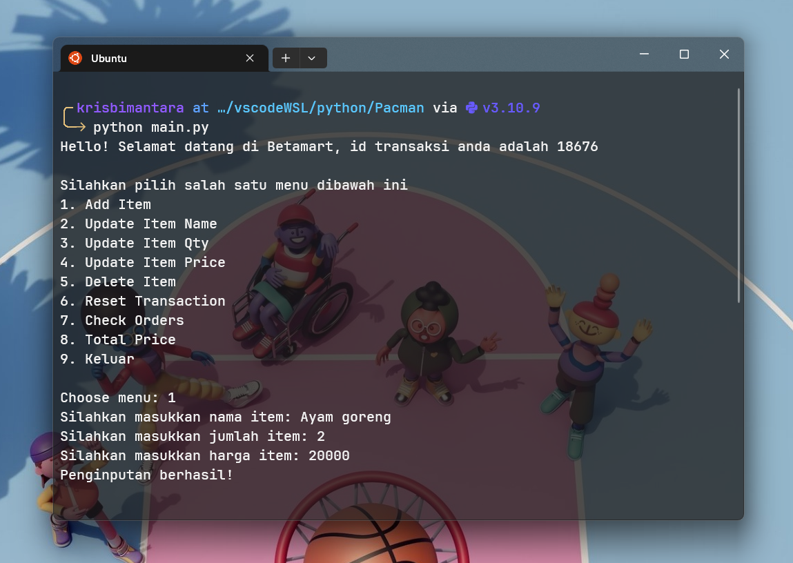
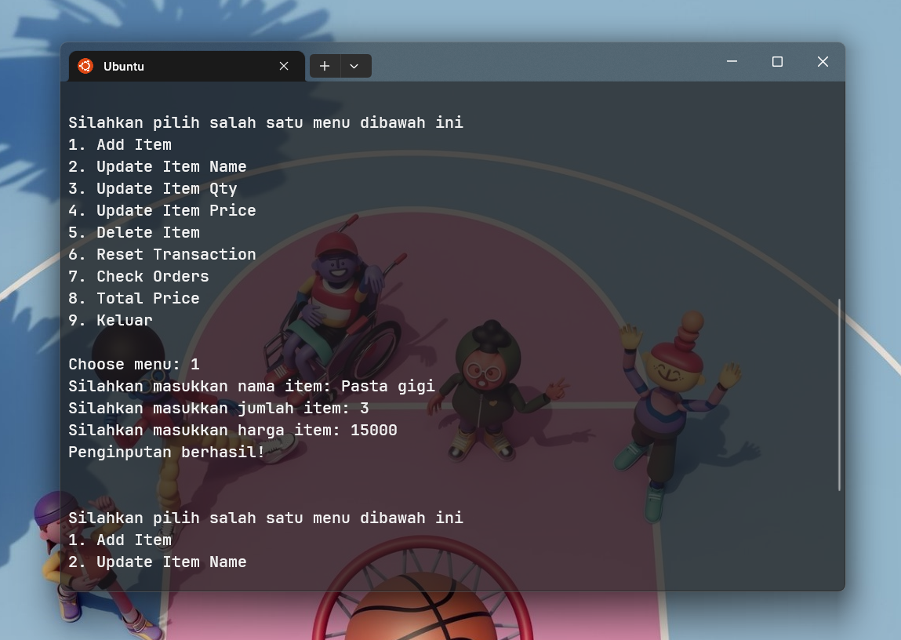

# self-service-supermarket
Sistem kasir self servie sederhana menggunakan bahasa pemrograman python

## Latar Belakang
Andi merupakan pemilik supermarket besar yang berencana untuk menginovasi bisnisnya. Andi berkeinginan membuat sistem kasir self-service di supermarketnya agar para customer dapat melakukan transaksi jarak jauh tanpa harus datang ke supermarket. Dengan adanya sistem kasir ini akan sangat membantu untuk melakukan transaksi pembelian, update barang dan aktivitas transaksi lainnya di sistem kasir tersebut

## Requirements dan Objective
### Objective
Memenuhi kebutuhan user untuk membuat self-service kasir di supermarket, sehingga customers bisa langsung memasukkan nama, jumlah, dan harga item yang ingin dibeli serta dapat menggunakan beberapa fitur lain yang dapat memudahkan customers saat berbelanja

### Requirements
1. Membuat id transaksi secara otomatis ketika customers memulai transaksi
2. Customers dapat menginput nama, jumlah, dan harga item yang ingin dibeli
3. Jika terdapat kesalahan, customers dapat melakukan update data nama, jumlah, dan harga item
4. Customers dapat menghapus salah satu item ataupun semua item secara langsung jika batal melakukan transaksi
5. Customers dapat melakukan pengecekan item yang sudah diinput, dan mendapatkan informasi megenai penginputan item sudah benar atau belum
6. Customers dapat mengetahui total harga yang dibayar, dengan penerapan beberapa ketentuan diskon

## Alur program
1. Customers memulai transaksi dan secara otomatis akan memunculkan id transaksi
2. Customers menginput angka sesuai dengan menu yang muncul ketika memulai transaksi
3. Jika customers menginput angka 1 maka customers akan diminta untuk memasukkan nama, jumlah, dan harga item
4. Jika customer menginput angka 2 maka customers akan mengupdate nama item yang telah diinput sebelumnya, customers akan diminta memasukkan nama item yang ingin diubah dan nama item yang baru, kemudian ketika telah memasukkan nama item tersebut akan muncul pesan apakah berhasil atau tidak
5. Jika customer menginput angka 3 maka customers akan mengupdate jumlah item yang telah diinput sebelumnya, customers akan diminta memasukkan nama item yang ingin diubah dan jumlah item yang baru, kemudian ketika telah memasukkan nama dan jumlah item tersebut akan muncul pesan apakah berhasil atau tidak
6. Jika customer menginput angka 4 maka customers akan mengupdate harga item yang telah diinput sebelumnya, customers akan diminta memasukkan nama item yang ingin diubah dan harga item yang baru, kemudian ketika telah memasukkan nama dan harga item tersebut akan muncul pesan apakah berhasil atau tidak
7. Jika customer menginput angka 5 maka customer akan menghapus salah satu item yang sudah ada dirincian belanja, customer akan diminta memasukkan nama item yang ingin dihapus, kemudia ketika telah memasukkan nama item akan muncul pesan apakah penghapusan item berhasil atau tidak
8. Jika customer menginput angka 6 maka customer akan menghapus seluruh item yang sudah ada dirincian belanja, customer tidak perlu memasukkan nama item ataupun yang lainnya karna akan langsung otomatis menghapus semua item
9. Jika customer menginput angka 7 maka customer akan melakukan pengecekan seluruh item yang telah dimasukkan kedalam rincian belanja, akan otomatis memunculkan tabel yang berisi nama, jumlah, harga, dan total harga item kemudian akan memunculkan pesan informasi mengenai apakah penginputan customer sudah benar atau tidak
10. Jika customer menginput angka 8 maka customer akan mengetahui total harga yang harus dibayarkan, dengan beberapa ketentuan diskon
11. Jika customer menginput angka 9 maka transaksi akan dianggap selesai

## Penjelasan kode program
### module.py
* `Transaction()` : Class yang menyimpan seluruh function untuk proses transaksi
* `__init__()` : method yang menginisialisasi id transaksi, dictionary yang menampung pesanan, value error, dan pesan pembuka
* `add_item()` : method untuk menambahkan barang ke rincian belanja dengan atribut nama, jumlah, dan harga item
* `update_item_name()` : method untuk melakukan perubahan nama item yang telah dimasukkan ke dalam rincian belanja 
* `update_item_qty()` : method untuk melakukan perubahan jumlah item yang telah dimasukkan ke dalam rincian belanja 
* `update_item_price()` : method untuk melakukan perubahan harga item yang telah dimasukkan ke dalam rincian belanja 
* `delete_item()` : method untuk menghapus salah satu item yang ada dirincian belanja sesuai namanya
* `reset_transaction()` : method untuk menghapus semua item yang ada dirincian belanja
* `check_orders()` : method untuk mnampilkan seluruh barang yang sudah diinput di daftar belanja, dan memberitahu customers apakah terdapat kesalahan dalam penginputan
* `total_price()` : method untuk menampilkan total harga yang harus dibayarkan customers dengan beberapa ketentuan diskon

### main.py
* `menu()` : fungsi untuk menampilkan menu utama untuk memudahkan customers selama proses transaksi

## Test Case
### Test 1
Menambahkan item dengan menggunakan method `add_item()`, item yang ditambahkan adalah
* Nama item: Ayam goreng, Jumlah: 2, Harga: 20000
* Nama item: Pasta gigi, Jumlah: 1, Harga: 15000

### Test 2
Menghapus salah satu item dengan menggunakan method `delete_item()`, item yang dihapus adalah Pasta gigi

### Test 3
Menghapus semua item yang ada dirincian belanja dengan menggunakan method `reset_transaction()`

### Test 4
Melakukan pengecekan transaksi menggunakan method `check_orders()`

### Test 5
Mengecek total harga yang harus dibayarkan menggunakan method `total_price()`

## Conclusion
